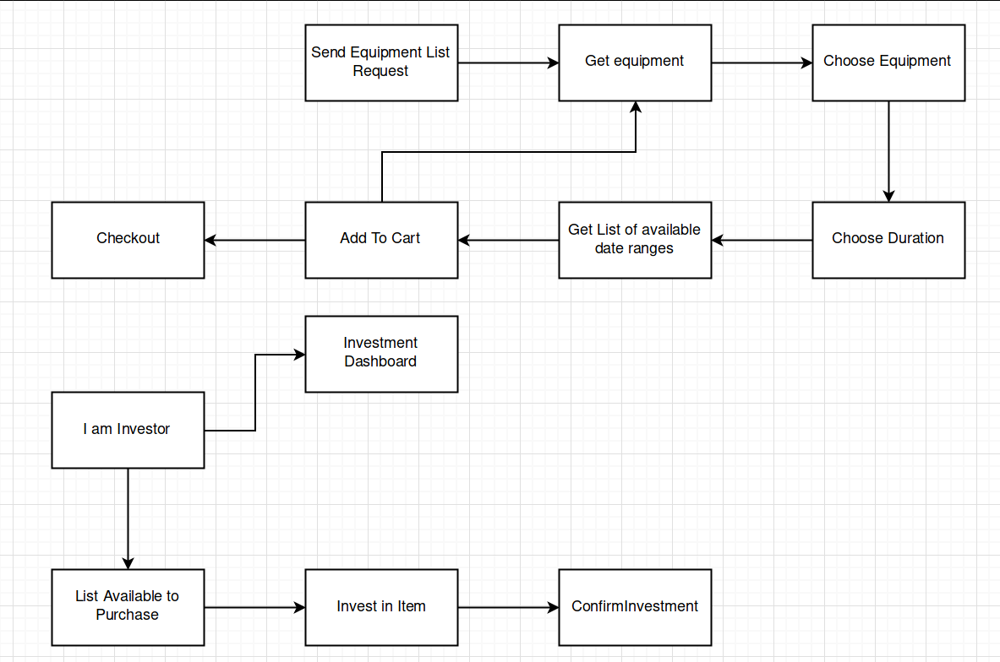
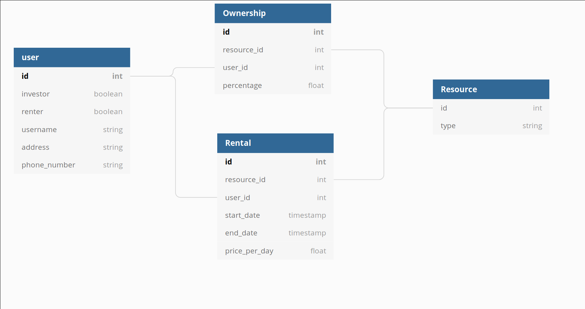

# fuber - an "uber" for Farming Equipment

Allow investors to invest in farming equipment that can be rented out to farmers - so farmers get access to equipment they might not otherwise be able to afford.

This concept that can be applied to other things, but for our example we are looking at farming equipment.

Project Kanban board on GitHub projects: <https://github.com/saifhaq/BTNG2019-Fuber/projects/1>

## Flow diagram

## Some user stories

### The farmer

    As a farmer,
    I need affordable access to farming machinery
    So I want a system that will let me rent the equipment for the duration I want

    As a farmer, 
    I may only have access to a basic mobile phone
    So I would like to use the system via SMS

    As a farmer,
    I may not have access to banking services
    So I need to be able to pay via my phone

### The Investor

    As an investor,
    I want to support businesses in emerging economies
    So I want an easy-to-use platform where I can contribute to a pool of equipment that can be rented out 

    (viability)
    As an investor,
    I like an incentive to invest
    So I shall receive a share of rental income

## Backend Design

## Our tools

Backend/Database design using [dbdiagram.io](https://dbdiagram.io), a tool for creating Entity-Relationship Diagrams.

[Google Cloud Platform (GCP)](https://cloud.google.com/) for hosting the backend

